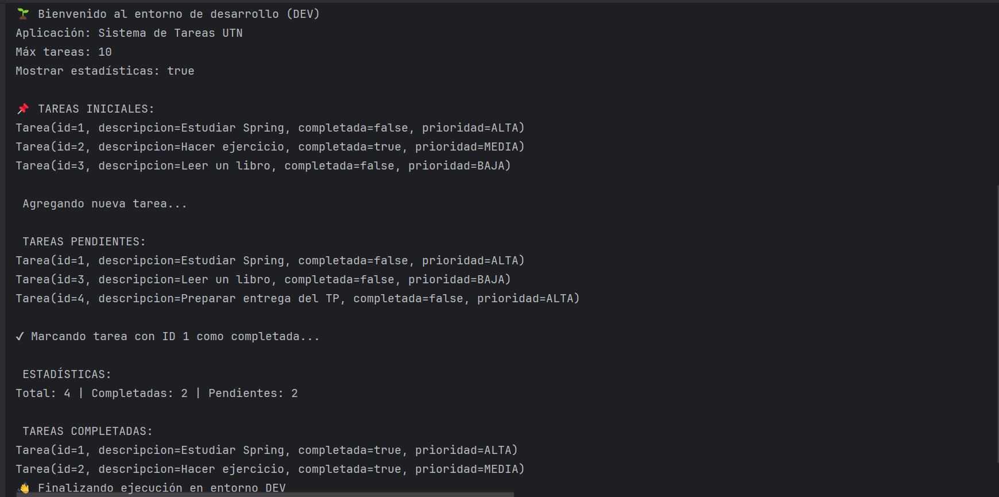
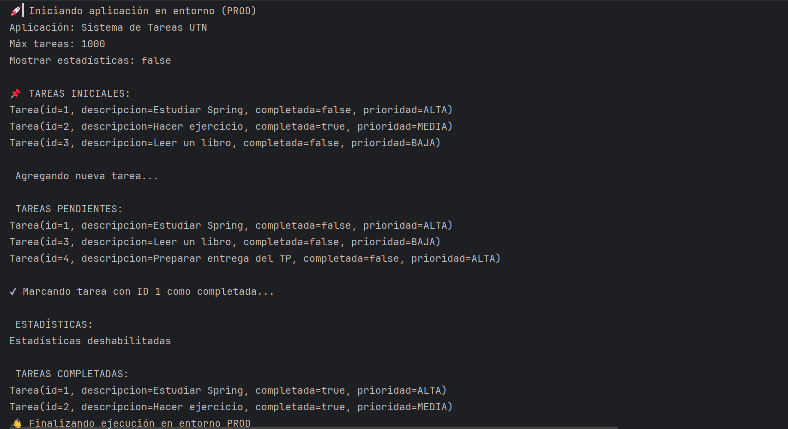

# TP_Spring_Boot
**Desarrollo de Software - 3k9**
Alumna: Brenda Alcoba Torres
Legajo: 50756

**Descripción del proyecto:**
    Este proyecto es un sistema simple de Gestión de Tareas (To-Do List) desarrollado utilizando Spring Boot, 
    aplicando todos los conceptos fundamentales aprendidos:

  - Inyección de dependencias (IoC)
  -  Beans y estereotipos (`@Service`, `@Repository`)
  - Configuración mediante `application.properties`
  - Profiles (`dev` y `prod`) para gestionar distintos entornos
  - Beans condicionales con `@Profile`
  - Ejecución inicial mediante `CommandLineRunner`
  - Lectura de properties con `@Value`

La aplicación se ejecuta por consola e imprime un flujo completo de operaciones:
      - Mensaje de bienvenida según el profile activo
      - Configuración actual
      - Listado de tareas iniciales
      - Agregar una tarea
      - Listar tareas pendientes
      - Completar una tarea
      - Mostrar estadísticas
      - Listar tareas completadas
      - Mensaje de despedida 

##   **Tecnologías Utilizadas**

* Lenguaje: Java 17
* Framework: Spring Boot 3.5.7
* Build Tool: Maven
* Librerías Adicionales: Spring Boot DevTools y Lombok.

## **Intrucciones para clonar y ejecutar**

1. Clonar el repositorio:
    git clone https://github.com/BrendaAlcoba/TP_Spring_Boot.git
2. Ejecutar la aplicación: 
    Abrir la clase TareasApplication y ejecutar:
   src/main/java/com/utn/tareas/TareasApplication.java
    El archivo application.properties tiene configurado spring.profiles.active=dev para el inicio predeterminado.

**Cómo cambiar entre profiles (dev/prod)**
▶ Activar DEV
    En application.properties:
        spring.profiles.active=dev
    Usa los valores de:
    application-dev.properties

▶ Activar PROD
    En application.properties:
        spring.profiles.active=prod
    Usa los valores de:
    application-prod.properties

    

## **Capturas de pantalla**

**Ejecución con Profile: dev**
Esta captura muestra el comportamiento del entorno dev: 
    límite bajo (app.max-tareas), 
    logs DEBUG, mensajes detallados, y 
    estadísticas visibles.

**Ejecución con Profile: prod**
Esta captura muestra el comportamiento del entorno prod: 
    límite alto (app.max-tareas), 
    mensajes concisos, y  
    estadísticas deshabilitadas.

💾 Commits Significativos

El historial de Git muestra el progreso de la implementación por fases:
1. "Creación del proyecto base"
2. "Modelo y repositorio"
3. "Implementado TareaService, lógica de negocio y configuraciones con @Value"
4. "Profiles para diferentes entornos"
5. "Clase principal y ejecución"

## **Conclusiones Personales**

Este trabajo práctico me permitió comprender el funcionamiento interno de Spring Boot, principalmente:

* Cómo se crean e inyectan beans
* Cómo separar configuraciones mediante perfiles
* Cómo estructurar una aplicación profesional usando las capas del framework
* Cómo externalizar configuraciones utilizando application.properties
* Cómo inicializar lógica con CommandLineRunner
